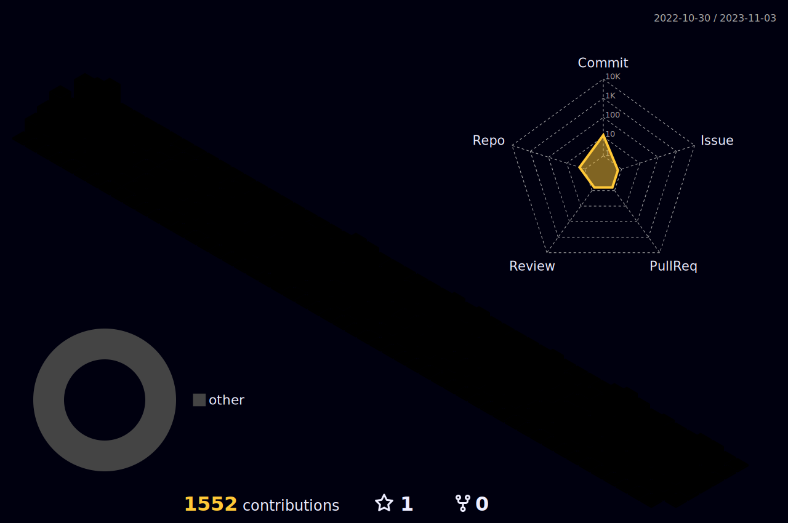

### Hi there 👋

- 🔭 I’m currently working on the [Noumena app](https://app.noumena.pro/)
- 🌱 I’m currently learning Blockchain
- 👯 I’m looking to collaborate on MERN-based projects.
- 🤔 I’m looking for help with code audits, brainstorming.
- 💬 Ask me about Javascript, the Big Bang theory and AI.
- 📫 How to reach me: hi@indered.in
- 😄 Pronouns: he/him
- ⚡ Fun fact: I can recite the entire alphabet backwards while standing on one foot. Impressed yet?

<h1  align='center'>
  
  
</h1>

### 💻 𝕃𝕒𝕟𝕘𝕦𝕒𝕘𝕖 𝕒𝕟𝕕 𝕋𝕠𝕠𝕝𝕤:  

  

 

  
  
  
  

  

  
  

  

  
  
  
  
  
 
  
   

  
  
  
  
  
  

 

<!--  -->

&nbsp;  
### 🎓 𝔼𝕕𝕦𝕔𝕒𝕥𝕚𝕠𝕟:
- Bachelor of Computer Sciences

### 💼 ℙ𝕠𝕣𝕥𝕗𝕠𝕝𝕚𝕠:  

  

### 📱 𝔽𝕠𝕝𝕝𝕠𝕨 𝕞𝕖:  

### ℂ𝕠𝕟𝕥𝕣𝕚𝕓𝕦𝕥𝕚𝕠𝕟𝕤: 

<!-- <h4 align='center'> 📍  𝕀'𝕞 𝕠𝕡𝕖𝕟 𝕥𝕠 𝕟𝕖𝕨 𝕛𝕠𝕓 𝕠𝕡𝕡𝕠𝕣𝕥𝕦𝕟𝕚𝕥𝕚𝕖𝕤  </h4> -->
<!--  -->
<!--  -->
<!--  -->
<!--  -->
<!--  -->
<!--  -->
<!--  -->

